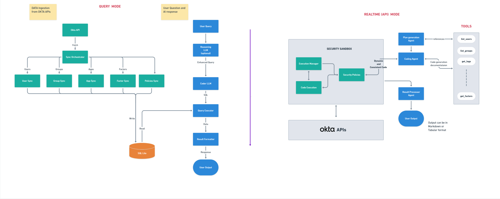

<div align="center">
  <a href="https://fctr.io">
    
  </a>
</div>

<h2 style="margin-left: 10px" align="center">Tako: AI Agent for Okta (v0.5.5-beta)</h2>

Meet Tako, the first AI agent of its kind that offers dual capabilities - both powerful database queries and real-time API operations through natural language. Built specifically for administrators, IAM managers, IT GRC teams and auditors, Tako leverages enterprise AI models to translate plain English questions into accurate data insights from synced databases or direct Okta API interactions. Our vision is to evolve Tako into a fully autonomous agent capable of performing nearly all Okta administrative functions while maintaining enterprise-grade security and compliance.

<div align="center">
<h3>📖 Featured Articles</h3>
<p>Learn more about Tako's journey and capabilities:</p>
<div style="margin: 20px 0;">
  <a href="https://iamse.blog/2025/05/21/tako-okta-ai-agent-takes-a-huge-step-towards-becoming-autonomous/" style="margin-right: 20px;">
    📚 Tako Takes a Huge Step Towards Becoming Autonomous (May 2025)
  </a>
  <br>
  <a href="https://iamse.blog/2025/02/20/okta-ai-agent-for-natural-language-querying/">
    📚 Okta AI Agent for Natural Language Querying (Feb 2025)
  </a>
</div>
</div>

<div align="center">
<h3>A new web interface!</h3>
</div>
<p align="center">
  
</p>

<div align="center">
<h3>Installation and Demo Video</h3>
<p>Watch our step-by-step installation guide and Tako feature demonstration:</p>
<div align="center">
      <a href="https://www.youtube.com/watch?v=PC8arYq5kZk">
         
      </a>
</div>
</div>

## 📋 Table of Contents

- [📋 Table of Contents](#-table-of-contents)
- [⚠️ BREAKING CHANGES ALERT](#️-breaking-changes-alert)
- [🆕 New in This Version (0.5.5-beta)](#-new-in-this-version-055-beta)
- [✨ What's Special?](#-whats-special)
- [🚀 Quick Start (The No-Frills Docker Way)](#-quick-start-the-no-frills-docker-way)
  - [Prerequisites](#prerequisites)
  - [Docker Compose](#docker-compose)
    - [Linux/macOS Instructions](#linuxmacos-instructions)
    - [Windows Instructions](#windows-instructions)
  - [🚨 Optimal API settings for maximum sync speed 🚨](#-optimal-api-settings-for-maximum-sync-speed-)
  - [⚠️ Important: Monitor for Errors](#️-important-monitor-for-errors)
  - [🆘 Need Help?](#-need-help)
  - [Launching the Application](#launching-the-application)
  - [Tailing docker logs](#tailing-docker-logs)
  - [Access the Web Interface](#access-the-web-interface)
  - [Dual Operation Modes](#dual-operation-modes)
  - [When to Use Each Mode](#when-to-use-each-mode)
  - [Realtime Agent Capabilities](#realtime-agent-capabilities)
  - [Additional Improvements](#additional-improvements)
  - [Available Tools for Realtime Mode](#available-tools-for-realtime-mode)
  - [LLM Requirements for Realtime Mode](#llm-requirements-for-realtime-mode)
- [🛡️ Security \& Privacy](#️-security--privacy)
  - [Common Security Features](#common-security-features)
    - [Access Management](#access-management)
    - [AI Provider Options](#ai-provider-options)
  - [Data Privacy by Mode](#data-privacy-by-mode)
    - [Database Mode](#database-mode)
    - [Realtime Mode](#realtime-mode)
  - [Database Mode Data Model](#database-mode-data-model)
- [⚠️ Good to Know](#️-good-to-know)
  - [Beta Release 🧪](#beta-release-)
  - [Security First 🛡️](#security-first-️)
  - [Current Limitations 🔍](#current-limitations-)
- [🗺️ Roadmap](#️-roadmap)
  - [Phase 1: Data Access \& Insights](#phase-1-data-access--insights)
  - [Phase 2: Infrastructure \& Interface Enhancements](#phase-2-infrastructure--interface-enhancements)
  - [Phase 3: Real-time Operations](#phase-3-real-time-operations)
  - [Phase 4: Autonomous Operations](#phase-4-autonomous-operations)
  - [Phase 5: Full Automation](#phase-5-full-automation)
- [🆘 Need Help?](#-need-help-1)
- [💡 Feature Requests \& Ideas](#-feature-requests--ideas)
- [👥 Contributors](#-contributors)
- [💌 Thank You](#-thank-you)
- [⚖️ Legal Stuff](#️-legal-stuff)

&nbsp;

## ⚠️ BREAKING CHANGES ALERT
> **IMPORTANT**: Version 0.5.5-beta contains breaking changes. If you are using previous versions or installed before 06/13/2025, you will need to completely redo your setup to ensure compatibility with the new realtime capabilities.
> 
> **Docker users:** Stop containers, delete SQLite files (`rm sqlite_db/*.db`), then restart.
> 
> **Repository Clone users:** Delete database files (`rm *.db sqlite_db/*.db`), update dependencies (`pip install -r requirements.txt`), then restart.

## 🆕 New in This Version (0.5.5-beta)
- **📋 Custom User Attributes** - You can define custom user attributes that will be synced and available for querying.
- **📱 Devices Sync** - Full devices sync with user relationships, security context, and analytics (Optional - set to false by default)
- **🔍 Enhanced Queries** - Query users by custom attributes and devices by platform, security status, etc.
- **🔒 SSL Certificate Support** - Self-signed certificates and organizational CAs are now supported for the openai_compatible provider
  
**Note**: Device sync controlled by `SYNC_OKTA_DEVICES` environment variable in .env file.

📋 **[View complete change log →](VERSION.md)**

## ✨ What's Special?

* 🚀 **Easy Okta Sync** - Quick and parallel okta sync to local SQLite DB
* 💡 **Natural Language Queries** - Talk to your Okta data with Tako using simple English
* 🔄 **Real-time Operation Mode** - Direct API interaction for up-to-the-second data access
* ⚡ **Multiple AI Providers** - Tako leverages the power of leading AI providers:
     -  Google Vertex AI (Gemini 1.5 Pro, 2.5 Pro)
     -  OpenAI (GPT-4, o4-mini)
     -  Azure OpenAI (GPT-4)
     -  Anthropic (Claude 3.7 Sonnet)
     -  Ollama (Local, Self-hosted, use 32B+ models)
     -  OpenAI Compatible APIs (Fireworks, Together AI, OpenRouter ...etc)
* 🖥️ **Web Interface** - Modern UI for easier interaction with Tako and your Okta data
  

## 🚀 Quick Start (The No-Frills Docker Way)

<div align="left">
  <h3>💡 Looking for alternative installation instructions?</h3>
  <h4><a href="https://github.com/fctr-id/okta-ai-agent/wiki/Installation">Visit our Installation Wiki</a> for more setup guides to get Tako running without Docker</h4>
</div>

### Prerequisites

✅ Docker installed on your machine  
✅ Okta tenant with superadmin access  
✅ Access to any of the supported AI providers  

### Docker Compose

The easiest way to get started is with Docker Compose:

#### Linux/macOS Instructions

```bash
# 1. Create a project directory and navigate to it
mkdir okta-ai-agent 
cd okta-ai-agent

# 2. Create required directories for data persistence
### Upload your own key and cert pem files to certs directory if you need them
mkdir -p sqlite_db logs certs

# 3. Download the docker-compose.yml file
curl -O https://raw.githubusercontent.com/fctr-id/okta-ai-agent/main/docker-compose.yml

# 4. Download and modify the .env file with your configuration
curl -O https://raw.githubusercontent.com/fctr-id/okta-ai-agent/main/.env.sample
mv .env.sample .env

# ⚠️ IMPORTANT: Edit the .env file with your settings! ⚠️
# The app will not work without properly configured environment variables
# nano .env (or use your favorite editor)
```

#### Windows Instructions

```powershell
# 1. Create a project directory and navigate to it
New-Item -ItemType Directory -Path okta-ai-agent
Set-Location okta-ai-agent

# 2. Create required directories for data persistence
### Upload your own key and cert pem files to certs directory if you need them
New-Item -ItemType Directory -Path sqlite_db, logs, certs -Force

# 3. Download the docker-compose.yml file
Invoke-WebRequest -Uri "https://raw.githubusercontent.com/fctr-id/okta-ai-agent/main/docker-compose.yml" -OutFile "docker-compose.yml"

# 4. Download and modify the .env file with your configuration
Invoke-WebRequest -Uri "https://raw.githubusercontent.com/fctr-id/okta-ai-agent/main/.env.sample" -OutFile ".env.sample"
Rename-Item -Path ".env.sample" -NewName ".env"

# ⚠️ IMPORTANT: Edit the .env file with your settings! ⚠️
# The app will not work without properly configured environment variables
# notepad .env (or use your favorite editor)
```

### 🚨 Optimal API settings for maximum sync speed 🚨

<p>

</p>

**For fastest sync times, set your API rate limit to 100% as shown above.**

If you cannot use 100%, use this table to set the optimal `OKTA_CONCURRENT_LIMIT` in your `.env` file:

| Tenant Type | API Rate Limit % | Recommended Setting | Tested Maximun (CAUTION ⚠️) |
|-------------|------------------|---------------------|-----------------|
| Integrator | 50% | 22 | 30 |
| Integrator | 75% | 34 | 40 |
| Integrator | 100% | 45 | 50 |
| One App | 50% | 135 | 200 |
| One App | 75% | 203 | 300 |
| One App | 100% | 270 | 400 |
| Enterprise | 50% | 135 | 200 |
| Enterprise | 75% | 203 | 300 |
| Enterprise | 100% | 270 | 400 |
| Workforce Identity | 50% | 135 | 270 |
| Workforce Identity | 75% | 203 | 405 |
| Workforce Identity | 100% | 270 | 540 |

### ⚠️ Important: Monitor for Errors

**Check your sync logs for this warning:**
```WARNING - Concurrent limit rate exceeded```

**If you see this error frequently:**
- Reduce your `OKTA_CONCURRENT_LIMIT` by 10-20 % and re-try
- Wait for sync to complete, then try a lower value
- Contact support@fctr.io if issues persist

### 🆘 Need Help?
If you experience frequent API rate limit errors, contact **support@fctr.io**

### Launching the Application

After configuring your .env file with your specific settings, launch the application:

```bash
docker compose up -d
```

### Tailing docker logs
```bash
docker compose logs -f
```

### Access the Web Interface
- 🌐 Open your browser and go to: https://localhost:8001 to start using Tako 🌐


### Dual Operation Modes

Tako now offers two powerful ways to interact with your Okta tenant:

- **Database Mode** - The original query engine for fast insights from synced data
- **Realtime Mode** - Direct API operations for up-to-the-second data access and complex workflows

### When to Use Each Mode

| Feature | Database Mode | Realtime Mode |
|---------|--------------|---------------|
| **Best for** | Historical analysis, reporting, bulk queries | Up-to-the-minute data, complex workflows |
| **Data freshness** | Limited to last sync time | Always current (direct API) |
| **Setup required** | Initial DB sync | None (instant access) |
| **Security** | No Okta data sent to LLMs | Small samples sent for processing |
| **Query complexity** | Better for simple queries | Handles multi-step operations |
| **Performance** | Faster for large data sets | Better for targeted lookups |

### Realtime Agent Capabilities

- **Direct API Integration** - Tako now connects directly to Okta's API for real-time data access
- **Intelligent Code Generation** - Safely generates and executes Python code based on your natural language queries
- **Multi-step Processing** - Complex queries are broken down into manageable steps with intelligent results processing
- **Command Line Interface** - New CLI script allows advanced queries without context limitations

### Additional Improvements

- **Anthropic Support** - Added Claude models as another AI provider option
- **Custom HTTP Headers** - Support for LLM proxies and security solutions
- **Enhanced Sync Process** - Better API-DB synchronization with cleaner logging
- **Performance Optimizations** - Faster response times and improved stability

### Available Tools for Realtime Mode

| Category | Tools |
|----------|-------|
| **User** | list_users, get_user, list_user_groups, list_factors |
| **Application** | list_applications, get_application, list_application_users, list_application_group_assignments |
| **Group** | list_groups, list_group_users, list_assigned_applications_for_group |
| **Events** | get_logs |
| **Network & Policy** | list_policy_rules, list_network_zones, get_network_zone |
| **DateTime Utilities** | get_current_time, parse_relative_time, format_date_for_query |

### LLM Requirements for Realtime Mode

> **IMPORTANT NOTICE**: Realtime agent functionality requires modern reasoning LLMs released after December 2024 to work effectively. Older models may not properly reason through complex API calls and data relationships.

**Tested and Compatible Models:**
- OpenAI - o4-mini
- Google Vertex AI - Gemini Pro 2.5
- Anthropic - Claude 3.7 Sonnet (with thinking)
- DeepSeek v3

Using older or less capable models may result in degraded performance or incorrect API calls when in realtime mode.

## 🛡️ Security & Privacy 

<p align="center">
  
</p>

### Common Security Features

#### Access Management
- **Your Token, Your Rules**: You create and control the Okta API token, including restricting its network access and role permissions
- **Least-Privilege Design**: Operates with read-only permissions by default for safe exploration

#### AI Provider Options
- **LLM Flexibility**: 
  - Use your enterprise-approved AI providers
  - Deploy Ollama locally for a completely air-gapped environment
  - Full control over model selection and data boundaries

### Data Privacy by Mode

#### Database Mode
- **Local Storage**: All Okta data is stored in SQLite DB - a file-based database that lives entirely on your PC/VM
- **Zero Cloud Dependencies**: Your organizational data never leaves your infrastructure
- **No Okta Data to LLMs**: Only user queries and system prompts are sent to AI providers

#### Realtime Mode
- **Direct API Access**: Queries Okta API directly with no local storage
- **Limited Data Sampling**: Small samples of query results are sent to AI providers for processing
- **Sandboxed Execution**: All code runs in a secure, isolated environment
- **Data Minimization**: Only data necessary to fulfill specific queries is processed

### Database Mode Data Model

The following data model applies only when using Database Mode with a synced SQLite database:

| Entity | Core Fields |
|--------|-------------|
| Users | `email`, `login`, `first_name`, `last_name`, `status`, `mobile_phone`, `primary_phone`, `employee_number`, `department`, `manager`, `password_changed_at`, `user_type`, `country_code`, `title`, `organization`, `custom_attributes` (as defined by user)|
| Groups | `name`, `description` |
| Applications | `name`, `label`, `status`, `sign_on_mode`, `metadata_url`, `sign_on_url`, `audience`, `destination`, `signing_kid`, `username_template`, `username_template_type`, `admin_note`, `attribute_statements`, `honor_force_authn`, `hide_ios`, `hide_web`, `policy_id`, `settings`, `features`, `visibility`, `credentials`, `licensing`, `embedded_url`, `accessibility`, `user_name_template`, `app_settings`, `app_embedded_url` |
| UserFactors | `factor_type`, `provider`, `status`, `email`, `phone_number`, `device_type`, `device_name`, `platform` |
| Policies | `name`, `description`, `status`, `type` |
| Devices | `display_name`, `platform`, `manufacturer`, `model`, `status`, `os_version`, `serial_number`, `udid`, `registered`, `secure_hardware_present`, `disk_encryption_type` |
| UserDevices | `management_status`, `screen_lock_type`, `user_device_created_at` (relationships between users and their devices) |

> **Note**: You can view the data saved to your SQLite DB using tools like [DB Browser for SQLite](https://github.com/sqlitebrowser/sqlitebrowser).

## ⚠️ Good to Know

### Beta Release 🧪
* Tako is still in testing grounds - keep it out of production!
* Currently focusing on core user fields
* Large orgs might need a coffee break during sync

### Security First 🛡️
* Data lives safely in your local SQLite
* AI/LLM sees only what it needs to
* Proper token hygiene required

### Current Limitations 🔍
* The responses are stateless, i.e., every query is answered as is asked without any relevance to the previous queries / responses.
* Tested on Identity engine only
* AI responses vary by provider
* Complex questions might need simplifying
* One tenant at a time

## 🗺️ Roadmap

### Phase 1: Data Access & Insights
- [x] Tako's natural language queries for Okta data
- [x] Multi-provider AI support
- [x] Save details for users, apps, groups, factors, policies and their relationships

### Phase 2: Infrastructure & Interface Enhancements
- [x] Modern Web Interface
  - Intuitive dashboard experience
  - Responsive design for all devices
  - Accessibility compliance
- [x] High-Performance API Backend
  - FastAPI implementation for enhanced throughput
  - Asynchronous request handling
  - Optimized database interactions
- [x] Enterprise Security Implementation
  - HTTPS with proper certificate management
  - Secure authentication mechanisms
  - Data protection in transit
- [x] Advanced Synchronization Interface
  - Visual synchronization monitoring
  - Progress tracking and analytics

### Phase 3: Real-time Operations
- [x] Live user summary
  - Profile, factors & activity snapshots
  - Risk indicators
  - Session management
- [x] Event Log Analytics
  - Natural language log queries
  - Anomaly detection
  - Custom report generation

### Phase 4: Autonomous Operations
- [ ] Automated Changes with Approval Workflow
  - Group memberships
  - Policy modifications
  - App assignments
- [ ] Self-service Integration
  - Chatbot interface
  - Teams/Slack integration
  - Email notifications

### Phase 5: Full Automation
- [ ] AI-driven Policy Management
- [ ] Automated User Lifecycle
- [ ] Intelligent Access Reviews
- [ ] Risk-based Authentication
- [ ] Complete Admin Automation

## 🆘 Need Help?

Before raising an issue with Tako, check:
1. 📝 `.env` configuration
2. 🔑 Okta API permissions
3. 🤖 AI provider setup
4. 📊 `logs` directory

Still having problems? Open an issue on GitHub, email support@fctr.io, or contact Dan directly:
- Email: dan@fctr.io
- Slack: dan@fctr.io

## 💡 Feature Requests & Ideas

Have an idea or suggestion? [Open a feature request](https://github.com/fctr-id/okta-ai-agent/issues/new?labels=enhancement) on GitHub!

## 👥 Contributors

Interested in contributing? We'd love to have you! Reach out to dan@fctr.io

## 💌 Thank You

Thank you for all the interest shown by users who have reached out to us for support and feature requests. We greatly appreciate your feedback and enthusiasm for Tako. Your suggestions help us make the product better!

## ⚖️ Legal Stuff

Check out [`License.md`](LICENSE) for the fine print.

---

🌟 © 2025 Fctr. All rights reserved. Meet Tako, made with ❤️ for the Okta community.
