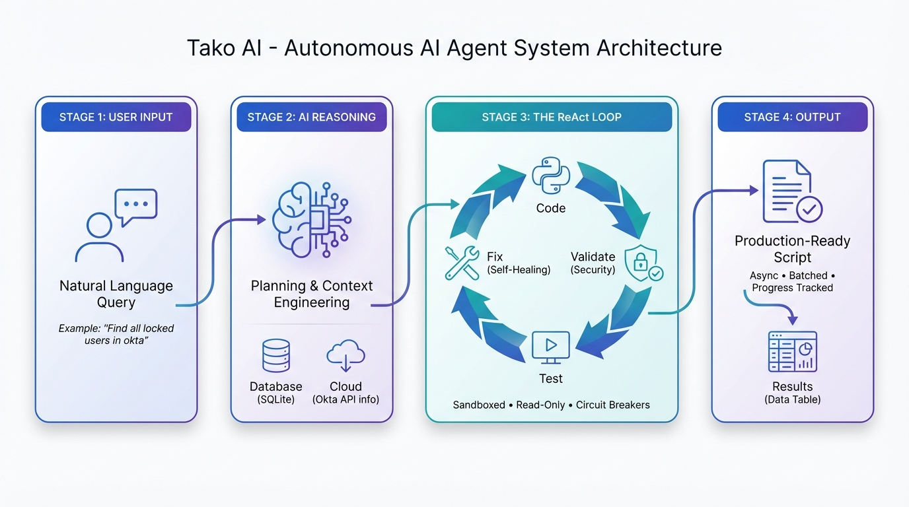

<div align="center">
  <a href="https://fctr.io">
    
  </a>
  
  <p><em>Built by the Fctr Identity team • Not affiliated with Okta</em></p>
  
  <h1>Tako: AI Agent for Okta (v1.5.0-beta)</h1>
  
  <p>🚀 <strong>NEW RELEASE:</strong> v1.5.0-beta introduces an Autonomous Reasoning Engine for Okta administrators, IAM managers, and IT teams. </p>
  <p><a href="VERSION.md">📋 Changelog →</a></p>
</div>


## What is Tako?

The world's first autonomous AI agent for Okta administration that thinks like a senior engineer, based on ReAct (reason and act) AI pattern.

### **Think → Generate Code → Sample Results → Repeat → Final Results**

Tako follows a deterministic workflow that validates every step, **catches its own mistakes**, and generates production-ready Python across **all 107+ Okta APIs**. Ask questions in plain English, get reproducible results with full transparency. **No scripting required.**

**Key Features:**
- 🗣️ **Natural language queries** - Ask questions in plain English, get instant results
- 🤖 **Autonomous ReAct agent** - Single intelligent agent with specialized tools for consistent, deterministic results  
- 💰 **Cost-effective models** - Runs on small, efficient LLMs. Faster and cheaper. (Gemini 2.0 Flash, Claude 3.5 Haiku, GPT-4o-mini)
- 📊 **Live progress tracking** - Real-time percentage updates, error counts, and cancellation support
- 📚 **Context-engineered grounding** - Okta API documentation optimized for LLM comprehension
- 🔄 **Flexible data access** - Query local SQLite database OR call Okta APIs directly (database sync is optional)
- 🔒 **Security-first** - Multiple validation layers, sandboxed execution, read-only by default
- 🐳 **Easy deployment** - Docker support for AMD64 and ARM64 platforms

<div align="center">
  
  <p><em>Tako's autonomous ReAct workflow: Think → Generate Code → Validate → Execute → Deliver Results</em></p>
</div>

<div align="center">
  
  <p><em>Demo: ReAct agent reasoning through queries with real-time progress updates and CSV download</em></p>
</div>

## 📋 Table of Contents

- [What is Tako?](#what-is-tako)
- [What Makes Tako Different?](#-what-makes-tako-different)
- [Quick Start (Docker)](#-quick-start-docker)
  - [Prerequisites](#prerequisites)
  - [Installation](#installation)
  - [Configure Rate Limits](#-configure-rate-limits-critical)
  - [Launch Application](#launch-application)
- [Featured Articles & Videos](#-featured-articles--videos)
- [AI Provider Support](#ai-provider-support)
  - [Supported Providers](#supported-providers)
  - [Tested Model Combinations](#tested-model-combinations)
- [Security & Privacy](#️-security--privacy)
  - [Architecture Overview](#architecture-overview)
  - [Security Features](#security-features)
  - [Database Schema](#database-schema)
- [Documentation & Support](#-documentation--support)
  - [Documentation](#documentation)
  - [Current Status](#current-status)
  - [Get Help](#get-help)
  - [Roadmap](#roadmap)

## 🆕 What Makes Tako Different?

### **Self-Healing Code**
Tako auto-corrects syntax errors, validates API parameters against Okta's spec, and retries intelligently when issues occur. Built-in circuit breakers prevent runaway loops, while automatic error tracking reports exactly what failed and why - eliminating trial-and-error cycles.

### **Cost-Effective Intelligence**
Run on lightweight, low-cost models (Gemini 2.0 Flash, Claude 3.5 Haiku, GPT-4o-mini) and reduce AI costs by 10-50x compared to premium models, while maintaining enterprise-grade accuracy through Tako's deterministic workflow.

### **Flexible Data Access**
- **API Mode** - Real-time Okta API calls (no database sync required)
- **Database Mode** - Optional: Sync to local SQLite for faster queries
- **Hybrid Mode** - Automatically selects optimal source when database is synced

### **Context-Engineered API Documentation**
Tako uses context-engineered Okta API documentation optimized for LLM comprehension, enabling accurate API calls and parameter validation without hallucination.

### Enterprise Performance & Security
- Intelligent rate limit management with dynamic batching (respects Okta's API quotas automatically)
- Optimized data processing for fast query execution
- 99% token reduction through intelligent filtering
- **Multiple security checks**: Schema validation, parameter verification, syntax checking, sandboxed execution

### 🆚 Tako vs. Okta MCP Server
While the Okta MCP Server is excellent for developers working inside IDEs (Cursor, Claude Desktop), Tako is designed as a **centralized team platform**.

| Feature | Okta MCP Server | Tako AI Agent |
|---------|-----------------|---------------|
| **Target Audience** | Developers & Architects | IT Teams, Help Desk, Security Analysts |
| **Interface** | IDE / Command Line | Web UI & Natural Language |
| **Setup** | Per-user configuration | Single Docker container for the team |
| **Context** | Limited by IDE context window | Full documentation + Database context |
| **Scale** | Ad-hoc queries | Enterprise-scale data processing |

## 🚀 Quick Start (Docker)

<h3>💡 Alternative Installation Options</h3>
<p><a href="https://github.com/fctr-id/okta-ai-agent/wiki/Installation">Visit our Installation Wiki</a> for non-Docker setup guides</p>

### Prerequisites

✅ Docker installed on your machine  
✅ Okta tenant with superadmin access  
✅ Access to any of the supported AI providers  
✅ **Authentication Setup**: [Configure OAuth 2.0 or API Token authentication →](https://github.com/fctr-id/okta-ai-agent/wiki/Authentication-&-Authorization-%E2%80%90-Oauth-2-and-API-tokens)

### Installation

**Tako supports multi-architecture deployment** with native images for both **AMD64** (Intel/AMD) and **ARM64** (Apple Silicon, AWS Graviton) platforms.

#### Linux/macOS Instructions

```bash
# 1. Create a project directory and navigate to it
mkdir okta-ai-agent 
cd okta-ai-agent

# 2. Create required directories for data persistence
mkdir -p sqlite_db logs certs

# (Optional) Place your own TLS cert/key as certs/cert.pem and certs/key.pem for custom HTTPS

# 3. Download the docker-compose.yml file
curl -O https://raw.githubusercontent.com/fctr-id/okta-ai-agent/main/docker-compose.yml

# 4. Download and modify the .env file with your configuration
curl -O https://raw.githubusercontent.com/fctr-id/okta-ai-agent/main/.env.sample
mv .env.sample .env

# ⚠️ IMPORTANT: Edit the .env file with your settings! ⚠️
# nano .env (or use your favorite editor)
```

#### Windows Instructions

```powershell
# 1. Create a project directory and navigate to it
New-Item -ItemType Directory -Path okta-ai-agent
Set-Location okta-ai-agent

# 2. Create required directories for data persistence
New-Item -ItemType Directory -Path sqlite_db, logs, certs -Force

# (Optional) Place your own TLS cert.pem and key.pem files in the certs directory for custom HTTPS

# 3. Download the docker-compose.yml file
Invoke-WebRequest -Uri "https://raw.githubusercontent.com/fctr-id/okta-ai-agent/main/docker-compose.yml" -OutFile "docker-compose.yml"

# 4. Download and modify the .env file with your configuration
Invoke-WebRequest -Uri "https://raw.githubusercontent.com/fctr-id/okta-ai-agent/main/.env.sample" -OutFile ".env.sample"
Rename-Item -Path ".env.sample" -NewName ".env"

# ⚠️ IMPORTANT: Edit the .env file with your settings! ⚠️
# notepad .env (or use your favorite editor)
```

### 🚨 Configure Rate Limits (Critical)

**Step 1:** We recommend you set it to 100% but depending on whatever value you set, please read the table below to get the variable value:


**Step 2:** Set `OKTA_CONCURRENT_LIMIT` in your `.env` file based on your Okta plan:

| Tenant Type | API Rate Limit % | Recommended Setting | Tested Maximum (CAUTION ⚠️) |
|-------------|------------------|---------------------|------------------------------|
| Integrator | 50% | 22 | 30 |
| Integrator | 75% | 34 | 40 |
| Integrator | 100% | 45 | 50 |
| One App | 50% | 135 | 200 |
| One App | 75% | 203 | 300 |
| One App | 100% | 270 | 400 |
| Enterprise | 50% | 135 | 200 |
| Enterprise | 75% | 203 | 300 |
| Enterprise | 100% | 270 | 400 |
| Workforce Identity | 50% | 135 | 270 |
| Workforce Identity | 75% | 203 | 405 |
| Workforce Identity | 100% | 270 | 540 |

**⚠️ Monitor for Rate Limit Warnings:**
```
WARNING - Concurrent limit rate exceeded
```

**If you see this frequently:**
- Reduce your `OKTA_CONCURRENT_LIMIT` by 10-20%
- Cancel the sync and try a lower value
- Contact support@fctr.io if issues persist

### Launch Application

After configuring your .env file with rate limits:

```bash
# Start Tako
docker compose up -d

# View logs
docker compose logs -f

# Open browser
https://localhost:8001
```

> ⚠️ **CRITICAL**: The application will not function unless your `.env` file is properly configured with all required authentication, AI provider, and rate limit variables. Double-check all settings before launching.

## 📖 Featured Articles & Videos

- [📚 Tako AI v1.5: Your New Okta Sidekick That Thinks, Codes, and Generates Results](docs/blog_post_v1.5.md)
- [📚 How Tako AI v1.1 Delivers Where Other Okta Tools Fall Short](https://iamse.blog/2025/08/07/tako-ai-v1-0-for-everyone-who-thought-ai-for-okta-was-just-hype/)
- [🎥 Installation and Demo Video](https://www.youtube.com/watch?v=PC8arYq5kZk)

## AI Provider Support

### Supported Providers

OpenAI, Google Vertex AI, Anthropic, Azure OpenAI, AWS Bedrock, Ollama (local), and OpenAI-compatible APIs.

**Dual Model Architecture:** Use separate models for reasoning and code generation to optimize costs.

### Tested Model Combinations

These model classes have been validated for stability and cost/performance trade-offs (you can still use others):

**Reasoning Models (Planning & Analysis)**
- **GPT-o4-mini** - (preferred)
- OpenAI GPT-OSS 120B
- Claude Sonnet 4
- Gemini 2.5 Pro
- O3 - Advanced reasoning capabilities (very expensive)
- GPT-5-mini - Works but is very slow (least expensive but needs more testing)

**Coding Models (API Code Generation)**
- **GPT-4.1** - (preferred)
- Claude Sonnet 4
- Gemini 2.5 Pro
- OpenAI GPT-OSS 120B

**Notes:**
- **Dual-model strategy**: lighter reasoning + stronger coding model can reduce cost
- **Provider variability**: slight output format differences are normal
- You can override any pairing via environment variables

## 🛡️ Security & Privacy

### Security Features

**Authentication & Authorization**
- **Your Token, Your Rules** - You create and control Okta API tokens with IP restrictions
- **Read-Only by Default** - Operates with least-privilege permissions for safe exploration
- **OAuth 2.0 & API Token Support** - Choose your preferred authentication method

<details>
<summary>🔓 <strong>Need Advanced Queries?</strong> Click to see optional permission setup</summary>

Some powerful features (like enumerating admin role assignments or advanced policy queries) require additional custom okta roles beyond basic read-only access.

**Quick Setup:**
1. Create a custom role with: **"View roles, resources, and admin assignments"**
2. Set resources to: **"All Identity and Access Management resources"**
3. Assign this custom role **in addition** to your existing READ-ONLY administrator role

This unlocks Tako's full analytical capabilities while maintaining security best practices.
</details>

**Data Protection**
- **Local Storage** - All Okta data stored in SQLite on your infrastructure
- **Zero Cloud Dependencies** - Your organizational data never leaves your environment
- **Limited Data Sampling** - Only small query samples sent to AI providers for processing
- **Sandboxed Execution** - All code runs in secure, isolated containers
- **Data Minimization** - Only necessary data processed for specific queries

**AI Provider Flexibility**
- Use enterprise-approved AI providers
- Deploy Ollama locally for completely air-gapped environments
- Full control over model selection and data boundaries

### Database Schema

When using Database Mode, Tako syncs these entities to local SQLite:

| **Entity** | **Core Fields** |
|------------|-----------------|
| **Users** | id, okta_id, email, login, first_name, last_name, status, mobile_phone, primary_phone, employee_number, department, manager, password_changed_at, status_changed_at, user_type, country_code, title, organization, custom_attributes, created_at, last_updated_at, last_synced_at, updated_at, is_deleted |
| **Groups** | id, okta_id, name, description, created_at, last_updated_at, last_synced_at, updated_at, is_deleted |
| **Applications** | id, okta_id, name, label, status, sign_on_mode, metadata_url, policy_id, sign_on_url, audience, destination, signing_kid, username_template, username_template_type, implicit_assignment, admin_note, attribute_statements, honor_force_authn, hide_ios, hide_web, created_at, last_updated_at, last_synced_at, updated_at, is_deleted |
| **UserFactors** | id, okta_id, user_okta_id, factor_type, provider, status, authenticator_name, email, phone_number, device_type, device_name, platform, created_at, last_updated_at, last_synced_at, updated_at, is_deleted |
| **Policies** | id, okta_id, name, description, status, type, created_at, last_updated_at, last_synced_at, updated_at, is_deleted |
| **Devices** | id, okta_id, status, display_name, platform, manufacturer, model, os_version, registered, secure_hardware_present, disk_encryption_type, serial_number, udid, created_at, last_updated_at, last_synced_at, updated_at, is_deleted |
| **UserDevices** | id, user_okta_id, device_okta_id, management_status, user_device_created_at, screen_lock_type, created_at, updated_at |
| **Authenticators** | id, okta_id, name, status, type, created_at, last_updated_at, last_synced_at, updated_at, is_deleted |

**Note:** You can view the synced data using tools like DB Browser for SQLite.

##  Documentation & Support

### Documentation
- 📖 [Installation Guide](https://github.com/fctr-id/okta-ai-agent/wiki/Installation)
- 🔐 [Authentication Setup](https://github.com/fctr-id/okta-ai-agent/wiki/Authentication-&-Authorization-%E2%80%90-Oauth-2-and-API-tokens)
- 🔍 [Supported API Endpoints](https://github.com/fctr-id/okta-ai-agent/wiki/Tako:-Supported-Okta-API-Endpoints)
- 📋 [Version History](VERSION.md)

### Current Status
- **Beta Release** - Not for production use
- **Minimum Version** - Use v1.3-beta or above
- **Requirements** - Okta Identity Engine, single tenant
- **Note** - Large tenants may see longer initial sync times in Database Mode

### Get Help

**Before opening an issue, check:**
1. 📝 `.env` configuration
2. 🔑 Okta API permissions  
3. 🤖 AI provider setup
4. 📊 Logs in `logs/` directory

**Support Channels:**
- 🐛 [GitHub Issues](https://github.com/fctr-id/okta-ai-agent/issues) - Bug reports and feature requests
- 📧 Email: support@fctr.io - General support  
- 💬 Slack: dan@fctr.io - Quick support

---

⭐ **Found Tako helpful?** [**Star this repo**](https://github.com/fctr-id/okta-ai-agent) to help other Okta admins discover it!

### Feature Requests & Ideas
- Have an enhancement in mind? [Open a feature request](https://github.com/fctr-id/okta-ai-agent/issues/new?labels=enhancement) and describe the use case.
- Clearly state data entities & outcome expected—this shortens triage time.

### Acknowledgements
Thanks to early community testers providing feedback on rate limits, hybrid mode edge cases, and model selection strategies—your input directly improved stability.

### Roadmap

**✅ Completed:**
- ReAct agent foundation with enterprise security
- Intelligent data source selection and query optimization  
- Modern LLM integration with advanced web interface

**🚧 In Progress:**
- Autonomous workflows and intelligent monitoring
- Self-service integration and advanced analytics

**🔮 Future:**
- AI-driven policy management and user lifecycle automation
- Risk-based authentication and autonomous administration

## 💡 Contributing

Interested in contributing? We'd love your help! Reach out to dan@fctr.io

## ⚖️ License

See [LICENSE](LICENSE) for details.

---

🌟 © 2025 Fctr. All rights reserved. Meet Tako, made with ❤️ for the Okta community.
