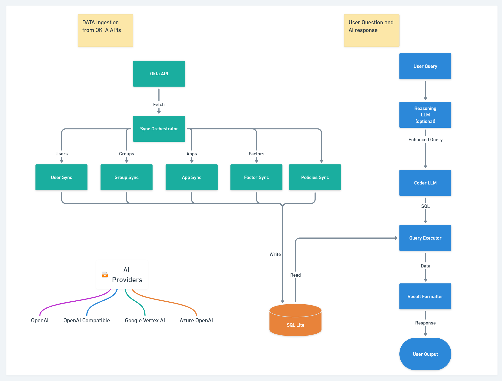

<div align="center">
  <a href="https://fctr.io">
    
  </a>
</div>

<h2 style="margin-left: 10px" align="center">Meet Tako, an AI -powered ally for Okta</h2>
<h2 style="margin-left: 10px" align="center"> (v0.3.6-BETA)</h2>

This AI agent is the first of its kind that lets you use natural language to query your Okta tenant's details. Built specifically for administrators, IAM managers, IT GRC teams and auditors, it leverages enterprise AI models to translate plain English questions into accurate data insights. Our vision is to evolve this into a fully autonomous agent capable of performing nearly all Okta administrative functions while maintaining enterprise-grade security and compliance.

<div align="center">
<h3>A new web interface!</h3>
</div>
<p align="center">
  
</p>

<div align="center">
<h3>Installation and Demo Video</h3>
<p>Watch our step-by-step installation guide and feature demonstration:</p>
<div align="center">
      <a href="https://www.youtube.com/watch?v=PC8arYq5kZk">
         
      </a>
</div>
</div>

## 📋 Table of Contents

- [📋 Table of Contents](#-table-of-contents)
- [⚠️ BREAKING CHANGES ALERT](#️-breaking-changes-alert)
- [✨ What's Special?](#-whats-special)
- [🚀 Quick Start (The No-Frills Docker Way)](#-quick-start-the-no-frills-docker-way)
  - [Prerequisites](#prerequisites)
  - [Docker Compose](#docker-compose)
    - [Linux/macOS Instructions](#linuxmacos-instructions)
    - [Windows Instructions](#windows-instructions)
    - [🚨 Optimal API settings for sync 🚨](#-optimal-api-settings-for-sync-)
  - [Launching the Application](#launching-the-application)
  - [Tailing docker logs](#tailing-docker-logs)
  - [Access the Web Interface](#access-the-web-interface)
- [🆕 What's New in v0.3.0](#-whats-new-in-v030)
- [🛡️ Security \& Privacy](#️-security--privacy)
  - [Data Control](#data-control)
    - [Technical Safeguards](#technical-safeguards)
    - [Access Management](#access-management)
    - [AI Provider Options](#ai-provider-options)
  - [Data Privacy](#data-privacy)
  - [Data Model Overview](#data-model-overview)
- [⚠️ Good to Know](#️-good-to-know)
  - [Beta Release 🧪](#beta-release-)
  - [Security First 🛡️](#security-first-️)
  - [Current Limitations 🔍](#current-limitations-)
- [🗺️ Roadmap](#️-roadmap)
  - [Phase 1: Data Access \& Insights](#phase-1-data-access--insights)
  - [Phase 2: Infrastructure \& Interface Enhancements](#phase-2-infrastructure--interface-enhancements)
  - [Phase 3: Real-time Operations](#phase-3-real-time-operations)
  - [Phase 4: Autonomous Operations](#phase-4-autonomous-operations)
  - [Phase 5: Full Automation](#phase-5-full-automation)
- [🆘 Need Help?](#-need-help)
- [💡 Feature Requests \& Ideas](#-feature-requests--ideas)
- [👥 Contributors](#-contributors)
- [⚖️ Legal Stuff](#️-legal-stuff)

&nbsp;

## ⚠️ BREAKING CHANGES ALERT
> **IMPORTANT**: Version 0.3.5-beta contains breaking changes. If you are using v0.3.5-beta or above, or installed after 03/26/2025, you will need to completely redo your setup to ensure compatibility. (Delete sqlLite DB and start fresh)

## ✨ What's Special?

* 🚀 **Easy Okta Sync** - Quick and parallel okta sync to local SQLite DB
* 💡 **Natural Language Queries** - Talk to your Okta data in simple English
* ⚡ **Multiple AI Providers** - Leverage the power of leading AI providers:
     -  Google Vertex AI (Gemini 1.5 Pro)
     -  OpenAI (GPT-4)
     -  Azure OpenAI (GPT-4)
     -  Ollama (Local, Self-hosted, use 32B+ models)
     -  OpenAI Compatible APIs (Fireworks, Together AI, OpenRouter ...etc)
* 🖥️ **Web Interface** - Modern UI for easier interaction with your Okta data
  

## 🚀 Quick Start (The No-Frills Docker Way)

<div align="left">
  <h3>💡 Looking for alternative installation instructions?</h3>
  <h4><a href="https://github.com/fctr-id/okta-ai-agent/wiki/Installation">Visit our Installation Wiki</a> for more setup guides which do not rely on docker</h4>
</div>

### Prerequisites

✅ Docker installed on your machine  
✅ Okta tenant with superadmin access  
✅ Access to any of the supported AI providers  

### Docker Compose

The easiest way to get started is with Docker Compose:

#### Linux/macOS Instructions

```bash
# 1. Create a project directory and navigate to it
mkdir okta-ai-agent 
cd okta-ai-agent

# 2. Create required directories for data persistence
### Upload your own key and cert pem files to certs directory if you need them
mkdir -p sqlite_db logs certs

# 3. Download the docker-compose.yml file
curl -O https://raw.githubusercontent.com/fctr-id/okta-ai-agent/main/docker-compose.yml

# 4. Download and modify the .env file with your configuration
curl -O https://raw.githubusercontent.com/fctr-id/okta-ai-agent/main/.env.sample
mv .env.sample .env

# ⚠️ IMPORTANT: Edit the .env file with your settings! ⚠️
# The app will not work without properly configured environment variables
# nano .env (or use your favorite editor)
```

#### Windows Instructions

```powershell
# 1. Create a project directory and navigate to it
New-Item -ItemType Directory -Path okta-ai-agent
Set-Location okta-ai-agent

# 2. Create required directories for data persistence
### Upload your own key and cert pem files to certs directory if you need them
New-Item -ItemType Directory -Path sqlite_db, logs, certs -Force

# 3. Download the docker-compose.yml file
Invoke-WebRequest -Uri "https://raw.githubusercontent.com/fctr-id/okta-ai-agent/main/docker-compose.yml" -OutFile "docker-compose.yml"

# 4. Download and modify the .env file with your configuration
Invoke-WebRequest -Uri "https://raw.githubusercontent.com/fctr-id/okta-ai-agent/main/.env.sample" -OutFile ".env.sample"
Rename-Item -Path ".env.sample" -NewName ".env"

# ⚠️ IMPORTANT: Edit the .env file with your settings! ⚠️
# The app will not work without properly configured environment variables
# notepad .env (or use your favorite editor)
```

#### 🚨 Optimal API settings for sync 🚨
<p>

</p>


For the best sync times, please set the API rate limit to 100% as shown above. In case you cannot set it to 100%, refer the table below to help you set the optimal `OKTA_CONCURRENT_LIMIT` setting in the `.env` file 

| Tenant Type | API Rate Limit %  | OKTA_CONCURRENT_LIMIT |
|-----------|---------|------------|
| Free / Developer | 50% | 6 |
| Free / Developer  | 100% | 15 |
| Enterprise  | 50% | 36 |
| Enterprise  | 100% | 75 |

If you are experiencing too many API rate limits and need assistance optimizing your deployment, please contact support@fctr.io.

### Launching the Application

After configuring your .env file with your specific settings, launch the application:

```bash
docker compose up -d
```

### Tailing docker logs
```bash
docker compose logs -f
```

### Access the Web Interface
- 🌐 Open your browser and go to: https://localhost:8001 🌐


## 🆕 What's New in v0.3.0

- **Web Interface** - Modern web UI for interacting with the agent, including:
  - Natural language query capabilities
  - Okta data synchronization controls
  - Entity counts and statistics dashboard
  - CSV export functionality for reporting and compliance
  - Advanced filtering and sorting of results for quick data discovery
- **Improved Data Sync Versioning & Maintenance** - Better versioning control and maintenance of synchronized data, reducing sync errors by 75%
- **Enhanced Logging System** - More comprehensive and detailed logging for better troubleshooting and audit trails
- **Improved Query Processing** - Better handling of complex natural language queries with 40% more accurate responses
- **Additional AI Provider Support** - Expanded model options including Google Vertex AI (Gemini 1.5 Pro) and self-hosted Ollama models
- **Bug Fixes and Performance Improvements** - Enhanced stability and response quality for enterprise environments
- **Major Sync Performance Improvements** - Up to 5x faster entity synchronization from Okta with parallel processing

## 🛡️ Security & Privacy 

<p align="center">
  
</p>

### Data Control

#### Technical Safeguards
- **Local Storage**: All Okta data is stored in SQLite DB - a file-based database that lives entirely on your PC/VM
- **Zero Cloud Dependencies**: Your organizational data never leaves your infrastructure

#### Access Management
- **Your Token, Your Rules**: You create and control the Okta API token, including restricting its network access and role permissions
- **Least-Privilege Design**: Operates with read-only permissions by default for safe exploration

#### AI Provider Options
- **LLM Flexibility**: 
  - Use your enterprise-approved AI providers
  - Deploy Ollama locally for a completely air-gapped environment
  - Full control over model selection and data boundaries

### Data Privacy 

- ✅ **What's Sent to LLMs**:
  - User queries (user prompts)
  - System prompts 
- ❌ **What's Not Sent**:
  - No Okta user data
  - No organizational data
  - No synced database contents
  

⚠️ **Future Features Notice** ⚠️

Future releases may introduce optional features that require sending Okta data to LLMs for summarization.
All such changes will be clearly documented in release notes.

### Data Model Overview 

| Entity | Core Fields |
|--------|-------------|
| Users | `email`, `login`, `first_name`, `last_name`, `status`, `mobile_phone`, `primary_phone`, `employee_number`, `department`, `manager`, `password_changed_at`, `user_type`, `country_code`, `title`, `organization` |
| Groups | `name`, `description` |
| Applications | `name`, `label`, `status`, `sign_on_mode`, `metadata_url`, `sign_on_url`, `audience`, `destination`, `signing_kid`, `username_template`, `username_template_type`, `admin_note`, `attribute_statements`, `honor_force_authn`, `hide_ios`, `hide_web`, `policy_id`, `settings`, `features`, `visibility`, `credentials`, `licensing`, `embedded_url`, `accessibility`, `user_name_template`, `app_settings`, `app_embedded_url` |
| UserFactors | `factor_type`, `provider`, `status`, `email`, `phone_number`, `device_type`, `device_name`, `platform` |
| Policies | `name`, `description`, `status`, `type` |


The relationship data for users -> factors, users -> groups, users -> applications 

Each entity includes: `tenant_id`, `okta_id`, `created_at`, `updated_at`

> **Note**: You can view the data saved to your SQLite DB using tools like [DB Browser for SQLite](https://github.com/sqlitebrowser/sqlitebrowser).


## ⚠️ Good to Know

### Beta Release 🧪
* Testing grounds - keep it out of production!
* Currently focusing on core user fields
* Large orgs might need a coffee break during sync

### Security First 🛡️
* Data lives safely in your local SQLite
* AI/LLM sees only what it needs to
* Proper token hygiene required

### Current Limitations 🔍
* The responses are stateless, i.e., every query is answered as is asked without any relevance to the previous queries / responses.
* Tested on Identity engine only
* AI responses vary by provider
* Complex questions might need simplifying
* One tenant at a time

## 🗺️ Roadmap

### Phase 1: Data Access & Insights
- [x] Natural language queries for Okta data
- [x] Multi-provider AI support
- [x] Save details for users, apps, groups, factors, policies and their relationships

### Phase 2: Infrastructure & Interface Enhancements
- [x] Modern Web Interface
  - Intuitive dashboard experience
  - Responsive design for all devices
  - Accessibility compliance
- [x] High-Performance API Backend
  - FastAPI implementation for enhanced throughput
  - Asynchronous request handling
  - Optimized database interactions
- [x] Enterprise Security Implementation
  - HTTPS with proper certificate management
  - Secure authentication mechanisms
  - Data protection in transit
- [x] Advanced Synchronization Interface
  - Visual synchronization monitoring
  - Progress tracking and analytics

### Phase 3: Real-time Operations
- [ ] Live user summary
  - Profile, factors & activity snapshots
  - Risk indicators
  - Session management
- [ ] Event Log Analytics
  - Natural language log queries
  - Anomaly detection
  - Custom report generation

### Phase 4: Autonomous Operations
- [ ] Automated Changes with Approval Workflow
  - Group memberships
  - Policy modifications
  - App assignments
- [ ] Self-service Integration
  - Chatbot interface
  - Teams/Slack integration
  - Email notifications

### Phase 5: Full Automation
- [ ] AI-driven Policy Management
- [ ] Automated User Lifecycle
- [ ] Intelligent Access Reviews
- [ ] Risk-based Authentication
- [ ] Complete Admin Automation

## 🆘 Need Help?

Before raising an issue, check:
1. 📝 `.env` configuration
2. 🔑 Okta API permissions
3. 🤖 AI provider setup
4. 📊 `logs` directory

Still having problems? Open an issue on GitHub or email support@fctr.io (response times may vary)

## 💡 Feature Requests & Ideas

Have an idea or suggestion? [Open a feature request](https://github.com/fctr-id/okta-ai-agent/issues/new?labels=enhancement) on GitHub!

## 👥 Contributors

Interested in contributing? We'd love to have you! Reach out to dan@fctr.io

## ⚖️ Legal Stuff

Check out [`License.md`](LICENSE) for the fine print.

---

🌟 © 2024 Fctr. All rights reserved. Made with ❤️ for the Okta community.
