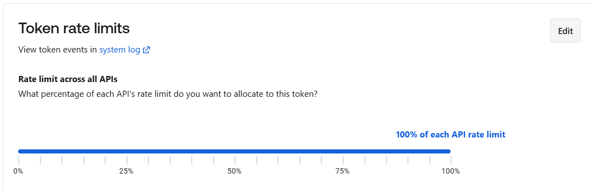
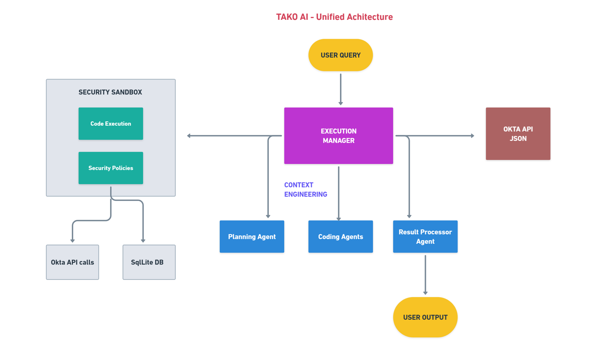

<div align="center">
  <a href="https://fctr.io">
    
  </a>
</div>

<div align="center">
  <p><em>Built by the Fctr Identity team • Not affiliated with Okta</em></p>
</div>

<h2 style="margin-left: 10px" align="center">Tako: Unified AI Agent for Okta (v1.0-beta)</h2>

Meet Tako, the **world's first multi-agent system** for Okta administration. Powered by **advanced context engineering** and intelligent data source selection, Tako automatically determines whether to use local database or real-time APIs for each query. With support for **107+ Okta GET API endpoints** and comprehensive database operations, Tako delivers enterprise-grade insights through natural language queries.

**NEW in v1.0-beta: Complete API-Only Operation** - No database sync required. Tako can now operate entirely through Okta's APIs, giving you real-time data without any local database dependencies.

Built for Okta administrators, IAM managers, IT GRC teams, and auditors - Tako represents a revolutionary approach to identity management automation, combining multiple specialized agents into one intelligent system that understands both your data relationships and real-time API requirements.

<div align="center">
<h3>📖 Featured Articles</h3>
<p>Learn more about Tako's journey and advanced multi-agent architecture:</p>
<div style="margin: 20px 0;">
  <a href="https://iamse.blog/2025/08/07/tako-ai-v1-0-for-everyone-who-thought-ai-for-okta-was-just-hype/" style="margin-right: 20px;">
    📚 How Tako AI v1.0 Delivers Where Other Okta Tools Fall Short: A Technical Reality Check for Skeptics
  </a>
</div>
</div>

<div align="center">
<h3>Revolutionary Multi-Agent Architecture</h3>
</div>
<p align="center">
  
</p>

<div align="center">
<h3>Installation and Demo Video</h3>
<p>Watch our step-by-step installation guide and Tako feature demonstration:</p>
<div align="center">
      <a href="https://www.youtube.com/watch?v=PC8arYq5kZk">
         
      </a>
</div>
</div>

## 📋 Table of Contents

- [📋 Table of Contents](#-table-of-contents)
- [⚠️ MAJOR ARCHITECTURE UPGRADE](#️-major-architecture-upgrade)
- [🆕 What Makes Tako Revolutionary?](#-what-makes-tako-revolutionary)
  - [🚀 Game-Changing Multi-Agent Architecture](#-game-changing-multi-agent-architecture)
  - [⚡ Multiple AI Provider Support](#-multiple-ai-provider-support)
  - [🔄 Enterprise-Grade Performance & Security](#-enterprise-grade-performance--security)
- [🚀 Quick Start (The No-Frills Docker Way)](#-quick-start-the-no-frills-docker-way)
  - [Prerequisites](#prerequisites)
  - [Docker Compose](#docker-compose)
    - [Linux/macOS Instructions](#linuxmacos-instructions)
    - [Windows Instructions](#windows-instructions)
  - [🚨 Optimal API settings for maximum sync speed 🚨](#-optimal-api-settings-for-maximum-sync-speed-)
  - [⚠️ Important: Monitor for Errors](#️-important-monitor-for-errors)
  - [🆘 Need Help?](#-need-help)
  - [Launching the Application](#launching-the-application)
  - [Tailing docker logs](#tailing-docker-logs)
  - [Access the Unified Agent Interface](#access-the-unified-agent-interface)
- [🧠 Tested LLMs](#-tested-llms)
- [🛡️ Security & Privacy](#️-security--privacy)
  - [Tako Architecture](#tako-architecture)
    - [Common Security Features](#common-security-features)
    - [API Token](#api-token)
    - [AI Provider Options](#ai-provider-options)
    - [Data Security](#data-security)
    - [Database Model](#database-model)
- [⚠️ Good to Know](#️-good-to-know)
  - [Beta Release 🧪](#beta-release-)
  - [Security First 🛡️](#security-first-️)
  - [Current Limitations 🔍](#current-limitations-)
- [🗺️ Roadmap](#️-roadmap)
- [🆘 Need Help?](#-need-help-1)
- [💡 Feature Requests & Ideas](#-feature-requests--ideas)
- [👥 Contributors](#-contributors)
- [💌 Thank You](#-thank-you)
- [⚖️ Legal Stuff](#️-legal-stuff)

&nbsp;

## ⚠️ MAJOR ARCHITECTURE UPGRADE
> **IMPORTANT**: Version 1.0-beta introduces a **completely new multi-agent architecture** with advanced context engineering and intelligent data source selection. This represents a fundamental evolution from previous versions.
> 
> **Previous v0.6.x users:** This version uses an entirely different approach. Your existing setup will work, but to access the new unified agent capabilities, follow the new installation process.
> 
> **Legacy Documentation:** Previous architecture documentation has been moved to our [Wiki](https://github.com/fctr-id/okta-ai-agent/wiki/Previous-Architecture).

## 🆕 What Makes Tako Revolutionary?

### **🚀 Game-Changing Multi-Agent Architecture**
- **5 Specialized Agents**: Planning, Execution Management, SQL, API, and Results Formatting working in perfect coordination
- **API-Only Operation**: NEW - Complete operation without database sync, access all data in real-time through 107+ API endpoints
- **Intelligent Data Selection**: Automatically chooses between database and API based on query requirements and data freshness
- **Universal API Support**: **Automatic code generation across ALL 107+ Okta GET endpoints** ([complete list →](https://github.com/fctr-id/okta-ai-agent/wiki/Tako:-Supported-Okta-API-Endpoints)) - not restricted to a few like previous versions

### **⚡ Multiple AI Provider Support**
Tako leverages the power of leading AI providers with enhanced compatibility:
- Google Vertex AI (Gemini 1.5 Pro, 2.5 Pro)
- OpenAI (GPT-4, o4-mini) 
- Azure OpenAI (GPT-4)
- Anthropic (Claude 3.7 Sonnet)
- AWS Bedrock (Claude, Nova, Llama models)
- Ollama (Local, Self-hosted, use 32B+ models)
- OpenAI Compatible APIs (Fireworks, Together AI, OpenRouter, etc.)

### **🔄 Enterprise-Grade Performance & Security**
- **Polars DataFrames**: Lightning-fast data processing and transformation
- **Advanced Context Engineering**: 99% token reduction through intelligent context filtering between agents
- **Multi-layered Security**: Comprehensive validation with enterprise security framework
- **Optimized Operations**: Smart filtering and parallel processing for cost-effective operations

## 🚀 Quick Start (The No-Frills Docker Way)

<div align="left">
  <h3>💡 Looking for alternative installation instructions?</h3>
  <h4><a href="https://github.com/fctr-id/okta-ai-agent/wiki/Installation">Visit our Installation Wiki</a> for more setup guides to get Tako running without Docker</h4>
</div>

### Prerequisites

✅ Docker installed on your machine  
✅ Okta tenant with superadmin access  
✅ Access to any of the supported AI providers  

### Docker Compose

The easiest way to get started is with Docker Compose:

#### Linux/macOS Instructions

```bash
# 1. Create a project directory and navigate to it
mkdir okta-ai-agent 
cd okta-ai-agent

# 2. Create required directories for data persistence
### Upload your own key and cert pem files to certs directory if you need them
mkdir -p sqlite_db logs certs

# 3. Download the docker-compose.yml file
curl -O https://raw.githubusercontent.com/fctr-id/okta-ai-agent/main/docker-compose.yml

# 4. Download and modify the .env file with your configuration
curl -O https://raw.githubusercontent.com/fctr-id/okta-ai-agent/main/.env.sample
mv .env.sample .env

# ⚠️ IMPORTANT: Edit the .env file with your settings! ⚠️
# The app will not work without properly configured environment variables
# nano .env (or use your favorite editor)
```

#### Windows Instructions

```powershell
# 1. Create a project directory and navigate to it
New-Item -ItemType Directory -Path okta-ai-agent
Set-Location okta-ai-agent

# 2. Create required directories for data persistence
### Upload your own key and cert pem files to certs directory if you need them
New-Item -ItemType Directory -Path sqlite_db, logs, certs -Force

# 3. Download the docker-compose.yml file
Invoke-WebRequest -Uri "https://raw.githubusercontent.com/fctr-id/okta-ai-agent/main/docker-compose.yml" -OutFile "docker-compose.yml"

# 4. Download and modify the .env file with your configuration
Invoke-WebRequest -Uri "https://raw.githubusercontent.com/fctr-id/okta-ai-agent/main/.env.sample" -OutFile ".env.sample"
Rename-Item -Path ".env.sample" -NewName ".env"

# ⚠️ IMPORTANT: Edit the .env file with your settings! ⚠️
# The app will not work without properly configured environment variables
# notepad .env (or use your favorite editor)
```

### 🚨 Optimal API settings for maximum sync speed 🚨

<p>

</p>

**For fastest sync times, set your API rate limit to 100% as shown above.**

If you cannot use 100%, use this table to set the optimal `OKTA_CONCURRENT_LIMIT` in your `.env` file:

| Tenant Type | API Rate Limit % | Recommended Setting | Tested Maximun (CAUTION ⚠️) |
|-------------|------------------|---------------------|-----------------|
| Integrator | 50% | 22 | 30 |
| Integrator | 75% | 34 | 40 |
| Integrator | 100% | 45 | 50 |
| One App | 50% | 135 | 200 |
| One App | 75% | 203 | 300 |
| One App | 100% | 270 | 400 |
| Enterprise | 50% | 135 | 200 |
| Enterprise | 75% | 203 | 300 |
| Enterprise | 100% | 270 | 400 |
| Workforce Identity | 50% | 135 | 270 |
| Workforce Identity | 75% | 203 | 405 |
| Workforce Identity | 100% | 270 | 540 |

### ⚠️ Important: Monitor for Errors

**Check your sync logs for this warning:**
```WARNING - Concurrent limit rate exceeded```

**If you see this error frequently:**
- Reduce your `OKTA_CONCURRENT_LIMIT` by 10-20 % and re-try
- Cancel the sync, then try a lower value
- Contact support@fctr.io if issues persist

### 🆘 Need Help?
If you experience frequent API rate limit errors, contact **support@fctr.io**

### Launching the Application

After configuring your .env file with your specific settings, launch the application:

```bash
docker compose up -d
```

### Tailing docker logs
```bash
docker compose logs -f
```

### Access the Unified Agent Interface
- 🌐 Open your browser and go to: https://localhost:8001 to start using Tako's new multi-agent system 🌐

## 🧠 Tested LLMs

Tako has been thoroughly tested with multiple LLM configurations to ensure optimal performance across different AI providers:

### **Reasoning Models** (Planning & Analysis)
- **O3** - Advanced reasoning capabilities
- **O4-mini** - Fast and efficient reasoning  
- **OpenAI GPT-OSS 120B** - Open-source high-performance reasoning
- **Claude Sonnet 4** - Superior analytical reasoning
- **Gemini 2.5 Pro** - Google's latest reasoning model

### **Coding Models** (API Code Generation)
- **GPT-4.1** - Reliable code generation
- **OpenAI GPT-OSS 120B** - Open-source coding excellence
- **Claude Sonnet 4** - Advanced code understanding
- **Claude Sonnet 3.7** - Proven coding reliability
- **Gemini 2.5 Pro** - Latest Google coding model
- **Gemini 1.5 Pro** - Stable Google coding model

### **Performance Notes**
- **Dual Model Setup**: Tako uses separate reasoning and coding models for optimal performance
- **Provider Flexibility**: Switch between providers based on your requirements and access
- **Cost Optimization**: Mix and match models (e.g., fast reasoning + powerful coding) for cost-effective operations
- **Enterprise Ready**: All models support enterprise deployment scenarios

## ️ Security & Privacy

### Tako Architecture

<div align="center">
  
  <p><em>Tako's revolutionary multi-agent architecture with intelligent data source selection</em></p>
</div>

#### Common Security Features
#### API Token
- **Your Token, Your Rules**: You create and control the Okta API token, including restricting its network access and role permissions
- **Least-Privilege Design**: Operates with read-only permissions by default for safe exploration

#### AI Provider Options
- **LLM Flexibility**: 
  - Use your enterprise-approved AI providers
  - Deploy Ollama locally for a completely air-gapped environment
  - Full control over model selection and data boundaries

#### Data Security

**Local Storage & Privacy**
- **Local Storage**: All Okta data is stored in SQLite DB - a file-based database that lives entirely on your PC/VM
- **Zero Cloud Dependencies**: Your organizational data never leaves your infrastructure
- **No Okta Data to LLMs**: Only user queries and system prompts are sent to AI providers
- **Limited Data Sampling**: Small samples of query results are sent to AI providers for processing
- **Sandboxed Execution**: All code runs in a secure, isolated environment
- **Data Minimization**: Only data necessary to fulfill specific queries is processed

#### Database Model
The following data model applies only when using Database Mode with a synced SQLite database:

| **Entity** | **Core Fields** |
|------------|-----------------|
| **Users** | id, okta_id, email, login, first_name, last_name, status, mobile_phone, primary_phone, employee_number, department, manager, password_changed_at, status_changed_at, user_type, country_code, title, organization, custom_attributes, created_at, last_updated_at, last_synced_at, updated_at, is_deleted |
| **Groups** | id, okta_id, name, description, created_at, last_updated_at, last_synced_at, updated_at, is_deleted |
| **Applications** | id, okta_id, name, label, status, sign_on_mode, metadata_url, policy_id, sign_on_url, audience, destination, signing_kid, username_template, username_template_type, implicit_assignment, admin_note, attribute_statements, honor_force_authn, hide_ios, hide_web, created_at, last_updated_at, last_synced_at, updated_at, is_deleted |
| **UserFactors** | id, okta_id, user_okta_id, factor_type, provider, status, authenticator_name, email, phone_number, device_type, device_name, platform, created_at, last_updated_at, last_synced_at, updated_at, is_deleted |
| **Policies** | id, okta_id, name, description, status, type, created_at, last_updated_at, last_synced_at, updated_at, is_deleted |
| **Devices** | id, okta_id, status, display_name, platform, manufacturer, model, os_version, registered, secure_hardware_present, disk_encryption_type, serial_number, udid, created_at, last_updated_at, last_synced_at, updated_at, is_deleted |
| **UserDevices** | id, user_okta_id, device_okta_id, management_status, user_device_created_at, screen_lock_type, created_at, updated_at |
| **Authenticators** | id, okta_id, name, status, type, created_at, last_updated_at, last_synced_at, updated_at, is_deleted |

**Note**: You can view the data saved to your SQLite DB using tools like DB Browser for SQLite.

## ⚠️ Good to Know

### Beta Release 🧪
- Tako is still in testing grounds - keep it out of production!
- Currently focusing on core user fields
- Large orgs might need a coffee break during sync

### Security First 🛡️
- Data lives safely in your local SQLite
- AI/LLM sees only what it needs to
- Proper token hygiene required

### Current Limitations 🔍
- The responses are stateless, i.e., every query is answered as is asked without any relevance to the previous queries / responses
- Tested on Identity engine only
- AI responses vary by provider
- Complex questions might need simplifying
- One tenant at a time

## 🗺️ Roadmap

### ✅ Completed: Multi-Agent Foundation
Revolutionary architecture with Planning, Execution, SQL, API, and Results agents. Enterprise security framework and comprehensive API coverage.

### ✅ Completed: Enhanced Intelligence  
Intelligent data source selection, Polars DataFrames operations, modern LLM integration, and advanced web interface.

### 🚧 In Progress: Autonomous Operations
Automated workflows, intelligent monitoring, self-service integration, and advanced analytics.

### 🔮 Future: Full Enterprise Automation
AI-driven policy management, complete user lifecycle automation, risk-based authentication, and autonomous administration.

## 🆘 Need Help?

Before raising an issue with Tako, check:
1. 📝 `.env` configuration
2. 🔑 Okta API permissions
3. 🤖 AI provider setup
4. 📊 `logs` directory

Still having problems? Open an issue on GitHub, email support@fctr.io, or contact Dan directly:
- Email: dan@fctr.io
- Slack: dan@fctr.io

## 💡 Feature Requests & Ideas

Have an idea or suggestion? [Open a feature request](https://github.com/fctr-id/okta-ai-agent/issues/new?labels=enhancement) on GitHub!

## 👥 Contributors

Interested in contributing? We'd love to have you! Reach out to dan@fctr.io

## 💌 Thank You

Thank you for all the interest shown by users who have reached out to us for support and feature requests. We greatly appreciate your feedback and enthusiasm for Tako. Your suggestions help us make the product better!

## ⚖️ Legal Stuff

Check out [`License.md`](LICENSE) for the fine print.

---

🌟 © 2025 Fctr. All rights reserved. Meet Tako, made with ❤️ for the Okta community.
